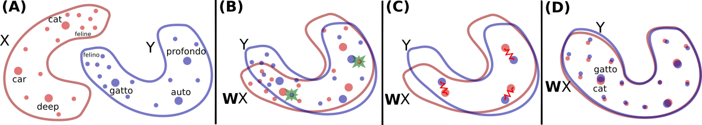
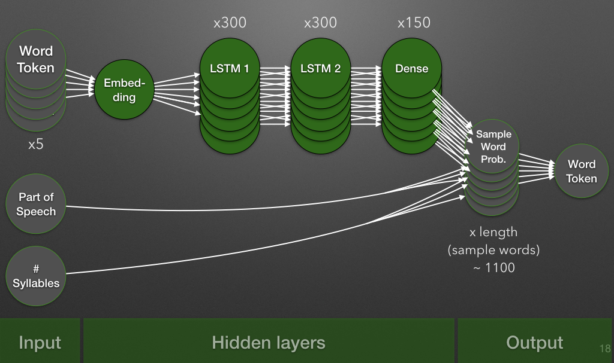

# Lyrix
## Master Semester Project at LSIR Lab - EPFL
### Olivier Couque and Emma Lejal Glaude

In this repository you will find the following elements:
- <b>Lyrix_report.ipynb</b>: This Jupyter Notebook will explain all the steps of our work on this project (from data collection to prediction). You will be able to follow the 2 different approaches that we implemented.
- <b>img</b> folder: This folder contains several images used in the Lyrix_report notebook.
- <b>webpage</b> folder: This folder contains all the files and explanations needed to run our demo of the project.
- <b>MUSE file creation.ipynb</b>: This notebook will guide you through the creation of files necessary to transfer style with a new pair of genres.

If you would like to run the notebook, you can find the source files (initial file and incremental versions of it) in a zip named data, available here: https://tinyurl.com/lyrix-data-zip.

### Project Executive Summary
The goal of this project is to merge lyrics from two different music genres. The idea is to transfer the style of one genre into a song from a different genre. Therefore, given a pair of genre (source, target), we will pick a song from the source genre, identify the particular words of the source genre and compute the replacement word from the target genre. This project explains two different approaches to do this computation: MUSE and a Neural Network.

The notebook is composed of the following parts:
1. Data Gathering: We explain here all the different actions we undertook in order to create our dataset of lyrics associated with their genre. We payed attention to have a distribution of genres as even as possible and to have English songs only.
2. Data Cleaning: The major part of cleaning was to delete the words in parenthesis, brackets, curly brackets and punctuation.
3. Preprocessing: We ran the FastText procedure to get the embeddings of our vocabulary.
4. MUSE: The first approach is detailed here, with several steps and analysis.
   1. TF-IDF: As part of our selection of specific words to replace, we compute the TF-IDF scores of all genres.
   2. MUSE: This is the part where we use the MUSE procedure to align the embeddings of the two genres.  
   3. Distance Analysis: We investigate the effect of the MUSE procedure on the embeddings, and verify that we indeed reduced the distance.
   4. Partial MUSE: We test here whether or not having a smaller percentage of common words between the two genres helps MUSE to align better the embeddings.
   5. Prediction Comparison: We make here a clear comparison of the predictions to decide which common words percentage is to keep. We also detail the procedure of our prediction and the files needed to run our demo.
5. Neural Network: The second approach is detailed here, with several steps and analysis.
   1. Input pre-processing: This step consist of loading the FastText embeddings and handle the words missing from the vocabulary.
   2. Exclusive words: This part analyses which words for each genre is considered as characteristic.
   3. Part of speech: In order to predict a word that has grammatical correctness, we need to know more about the part of speech distribution and probabilities. We compute the Prior probabilities and the probabilities of the next Part of Speech. We also compute the distribution of Part of Speech according to each genre, in order to form a sample vocabulary with the same proportions to train our neural network.
   4. Most common words: As the exclusive words lead to poor results, we implement here another strategy to spot the interesting words. We will use the following scoring system :
   
   5. Sample words: This part shows the selection process of the words our neural network could predict. We require the word to have at least 200 occurences and it must match as best as possible the part-of-speech distribution from the genre.
   6. Words Tokenization: This step turns our selected words into integers, with the help of the Keras library.
   7. Input of Neural Net: This is the creation of the N-Grams used as inputs of the Neural Network and making sure that we have the same number of N-Grams for each output (to avoid biases). We also apply the train-test-validation splitting.
   8. Model Creation: This step creates the Neural Network, according to our structure.
  
   9. Predict words: After the training of the Neural Network, we analyse its results, its accuracy for the prediction (Categorical accuracy) as well as the part-of-speech accuracy and the syllable accuracy.
   10. Lyrics Generation: We make here an attempt to generate full lyrics with a 5-words seed. We can note that if the part of speech is satisfied, the meaning is poor and the repetitions high.
   11. Genre Fusion: In this part, we make the same type of predictions as for MUSE, we select the "most common" words, extract the 5-words seed leading to those words and use them as input to the neural network of the target genre: we therefore have the transfered word to replace in the song.
6. Webpage: We included screenshots of the demo we implemented and how to use it.
7. Conclusion: We present here our thoughts about how to improve our project.

We hope that you will enjoy our work, 
If you have any question, please contact us: olivier.couque@epfl.ch & emma.lejal-glaude@epfl.ch
